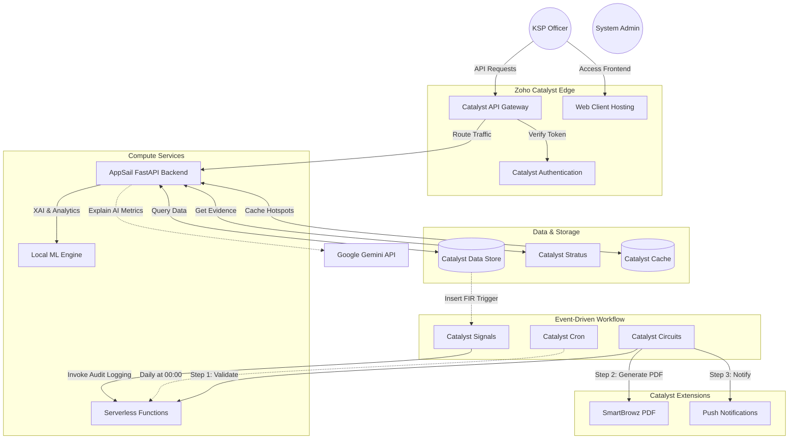

# Zoho Catalyst Architecture Diagram

```mermaid
graph TD
    %% Users
    User((KSP Officer))
    Admin((System Admin))

    %% Catalyst Edge
    subgraph Edge ["Zoho Catalyst Edge"]
        Gateway[Catalyst API Gateway]
        Auth[Catalyst Authentication]
        Web[Web Client Hosting]
    end

    %% Compute Tier
    subgraph Compute ["Compute Services"]
        AppSail[AppSail FastAPI Backend]
        Functions[Serverless Functions]
        
        AppSail -->|XAI & Analytics| LocalML[Local ML Engine]
    end

    %% Event & Workflow Tier
    subgraph Events ["Event-Driven Workflow"]
        Signals[Catalyst Signals]
        Cron[Catalyst Cron]
        Circuits[Catalyst Circuits]
    end

    %% Storage & Cache Tier
    subgraph Data ["Data & Storage"]
        DataStore[(Catalyst Data Store)]
        Stratus[Catalyst Stratus]
        Cache[(Catalyst Cache)]
    end

    %% External Services
    subgraph Ext ["Catalyst Extensions"]
        SmartBrowz[SmartBrowz PDF]
        Push[Push Notifications]
    end

    %% Connections
    User -->|Access Frontend| Web
    User -->|API Requests| Gateway
    Gateway -->|Verify Token| Auth
    Gateway -->|Route Traffic| AppSail

    AppSail <-->|Query Data| DataStore
    AppSail <-->|Cache Hotspots| Cache
    AppSail <-->|Get Evidence| Stratus

    %% Event Connections
    DataStore -.->|Insert FIR Trigger| Signals
    Signals -->|Invoke Audit Logging| Functions
    
    Cron -.->|Daily at 00:00| Functions
    
    Circuits -->|Step 1: Validate| Functions
    Circuits -->|Step 2: Generate PDF| SmartBrowz
    Circuits -->|Step 3: Notify| Push

    %% Gemini
    AppSail -.->|Explain AI Metrics| Gemini[Google Gemini API]
```
